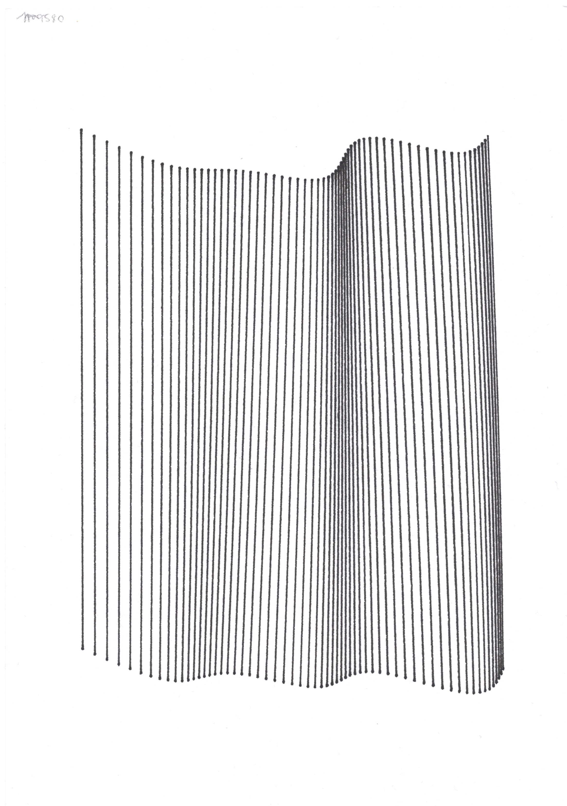
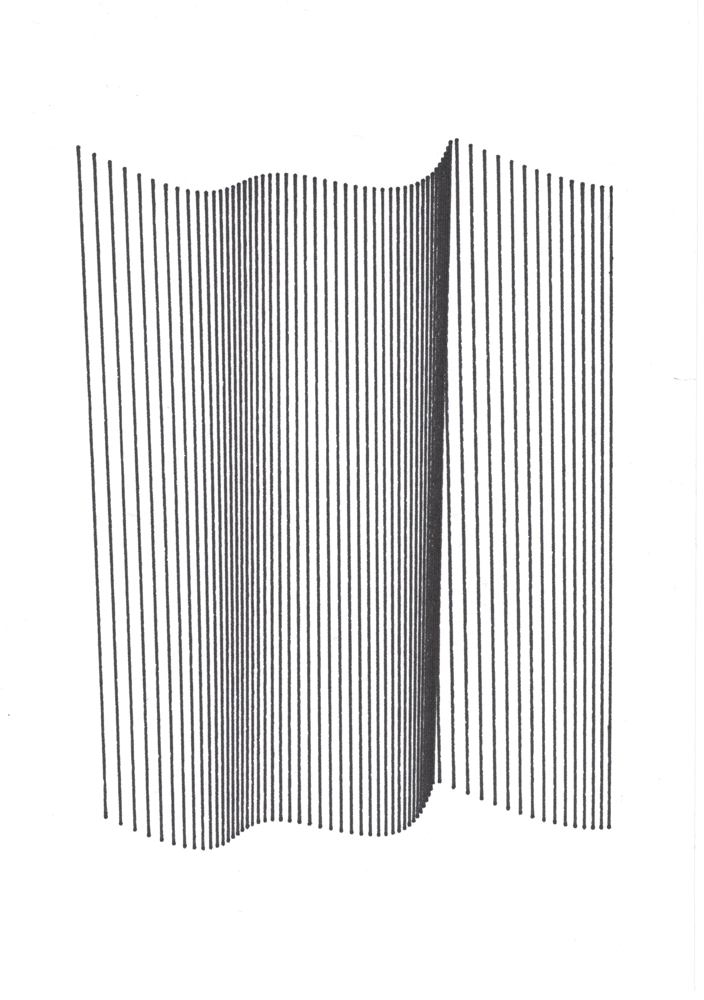
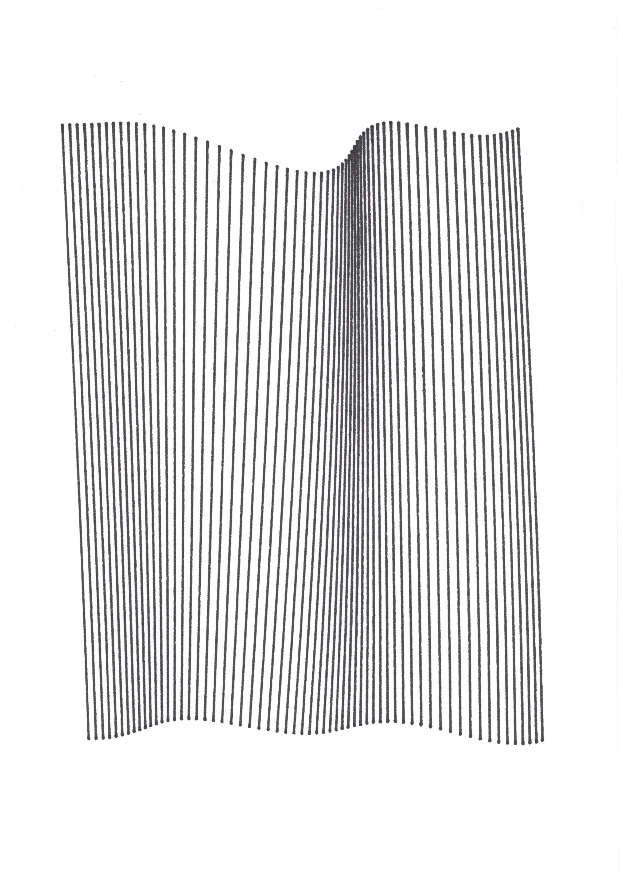
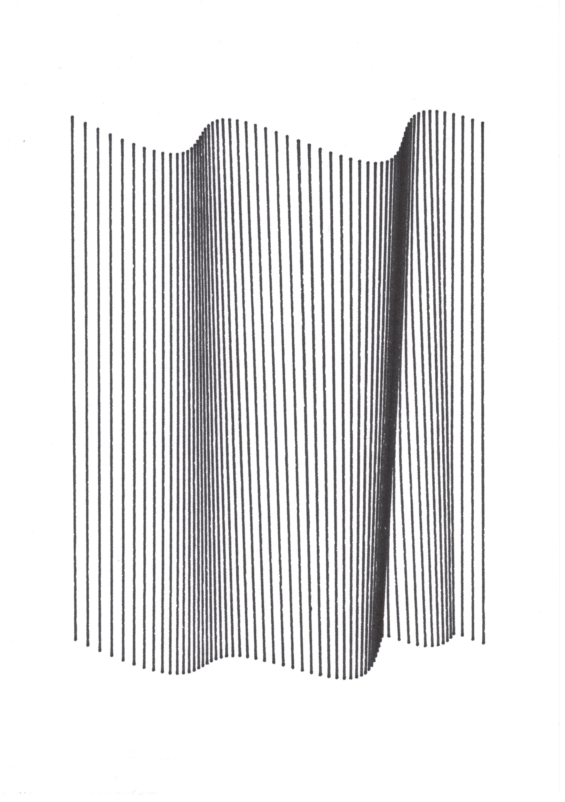

# 004

2d simplex noise grid with lines which looks like curtains.

## Example

01                     | 02                     | 03                     | 04
:---------------------:|:----------------------:|:----------------------:|:----------------------:
 |  |  |  

## Usage

The project is based on the following boilerplate: 
`git clone --depth 1 git@github.com:mkontogiannis/p5.js-es6.git`

Install the dependencies: 
`npm install`

Use the following command while writing a sketch to start the dev server with hot reloading: 
`npm run dev`

Use the following command when done to build the bundled minified result under the `/dist` folder: 
`npm run build`
